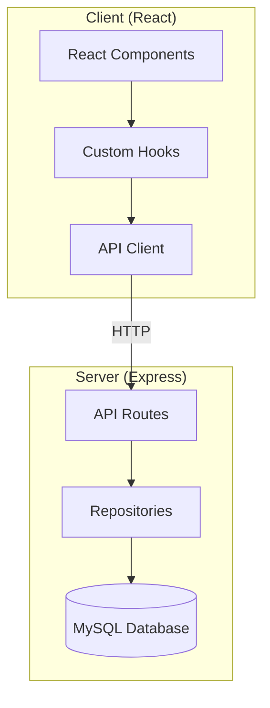
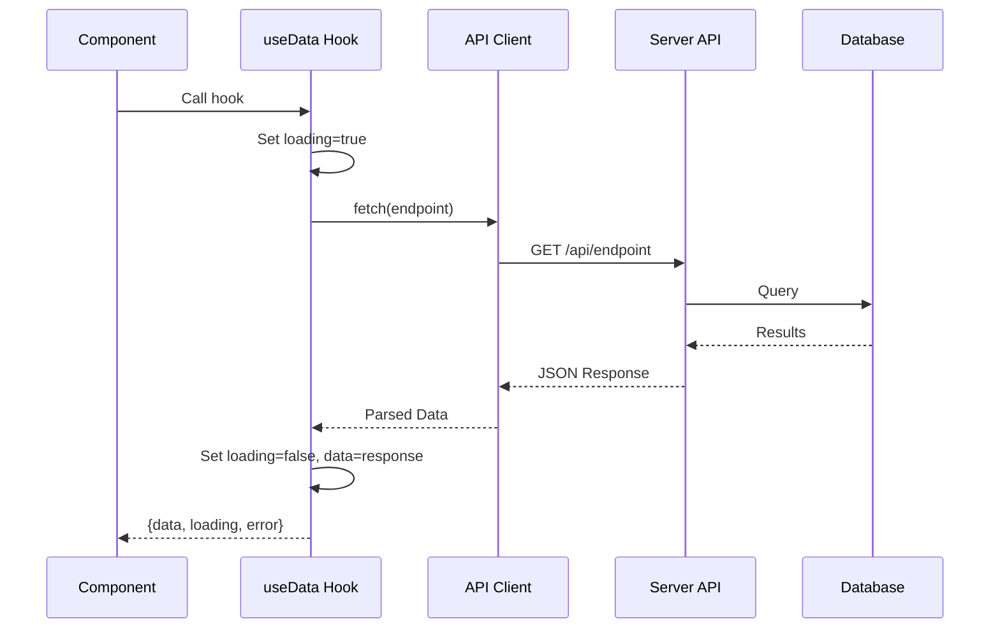

# Design Document

## Overview

Tài liệu này mô tả thiết kế chi tiết cho việc chuyển đổi hệ thống Nexus từ mock data sang real API. Thiết kế tập trung vào việc tạo API client, custom hooks, và migrate các components.

## Architecture

### High-Level Architecture



### Data Flow



## Components and Interfaces

### API Client

```typescript
// client/src/services/api.ts
const API_BASE_URL = 'http://localhost:3001/api';

export async function fetchAPI<T>(endpoint: string): Promise<T> {
  const response = await fetch(`${API_BASE_URL}${endpoint}`);
  if (!response.ok) {
    throw new Error(`API Error: ${response.status}`);
  }
  return response.json();
}
```

### Custom Hooks Interface

```typescript
// Generic hook return type
interface UseDataResult<T> {
  data: T | null;
  loading: boolean;
  error: Error | null;
  refetch: () => void;
}

// Hook implementations
function useUsers(): UseDataResult<EmployeeProfile[]>;
function useDepartments(): UseDataResult<Department[]>;
function useProjects(): UseDataResult<Project[]>;
function useMeetingRooms(): UseDataResult<MeetingRoom[]>;
function useBookings(): UseDataResult<Booking[]>;
```

### Component Migration Map

| Component | Current Import | New Hook |
|-----------|---------------|----------|
| UserManager | MOCK_USERS | useUsers() |
| DepartmentManager | MOCK_DEPARTMENTS, MOCK_USERS, MOCK_PROJECTS | useDepartments(), useUsers(), useProjects() |
| OrgChart | MOCK_DEPARTMENTS | useDepartments() |
| ProjectModule | MOCK_PROJECTS | useProjects() |
| ProjectDetailView | MOCK_TASKS, MOCK_TASK_COLUMNS, MOCK_USERS | useProjectTasks(), useUsers() |
| MeetingAdmin | MOCK_MEETING_ROOMS, MOCK_BOOKINGS, MOCK_USERS | useMeetingRooms(), useBookings(), useUsers() |
| CreateTaskModal | MOCK_USERS | useUsers() |

## Data Models

Sử dụng các types đã định nghĩa trong `shared/types/`:
- EmployeeProfile
- Department
- Project
- Task
- TaskColumn
- MeetingRoom
- Booking

## Correctness Properties

*A property is a characteristic or behavior that should hold true across all valid executions of a system-essentially, a formal statement about what the system should do. Properties serve as the bridge between human-readable specifications and machine-verifiable correctness guarantees.*

### Property 1: API Response Parsing

*For any* valid API response, the fetchAPI function should return parsed JSON data that matches the expected type structure.

**Validates: Requirements 1.2**

### Property 2: Loading State Consistency

*For any* data fetching hook, the loading state should be true while the request is in progress and false after completion (success or failure).

**Validates: Requirements 2.6**

## Error Handling

### API Client Errors

1. **Network Error**: Khi không thể kết nối đến server
2. **HTTP Error**: Khi server trả về status code lỗi (4xx, 5xx)
3. **Parse Error**: Khi response không phải JSON hợp lệ

### Hook Error States

```typescript
interface ErrorState {
  message: string;
  status?: number;
  retry: () => void;
}
```

## Testing Strategy

### Unit Testing

- **Framework**: Vitest
- Test API client functions
- Test custom hooks với mock fetch

### Property-Based Testing

- **Framework**: fast-check
- **Minimum iterations**: 100 per property

#### Property Tests

1. **Loading State Property Test**
   - Generate random delay times
   - Verify loading state transitions correctly
   - Tag: **Feature: api-integration, Property 2: Loading State Consistency**

### Integration Testing

- Test hooks với real API endpoints
- Test component rendering với fetched data
