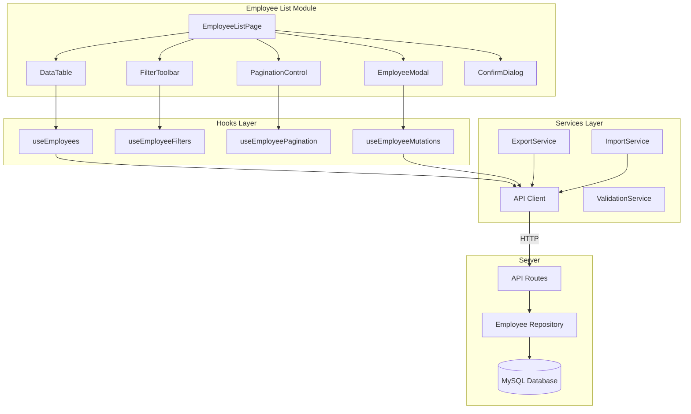
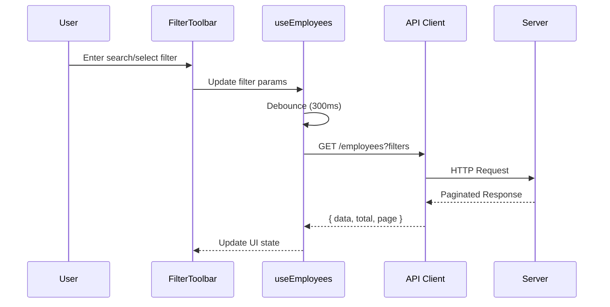
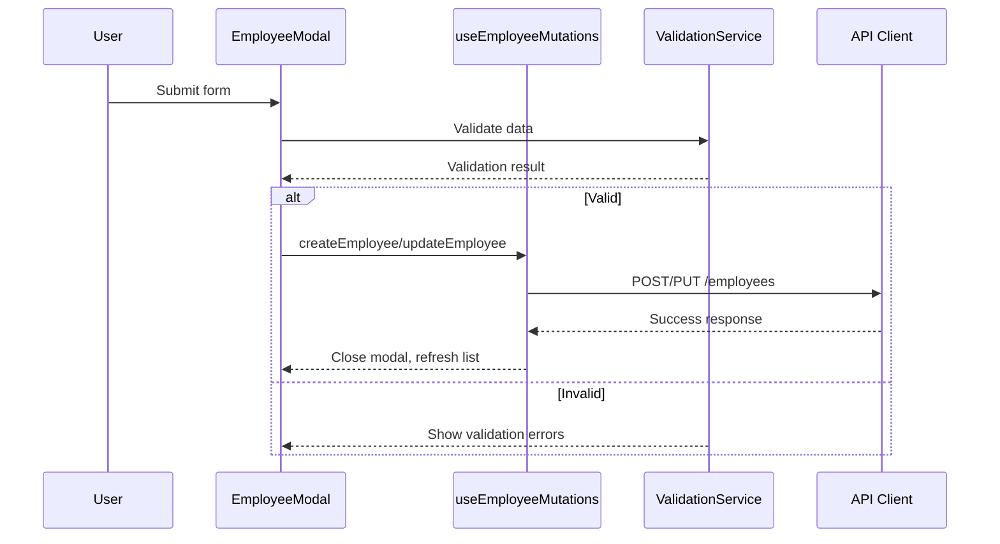

# Design Document

## Overview

This document describes the detailed design for the Employee List Module - a comprehensive employee management page that provides administrators with capabilities to view, search, filter, paginate, and manage employee records. The module integrates with the existing application architecture, utilizing the established API client pattern, custom hooks, and UI component library.

The design follows the existing patterns from the api-integration spec while adding new features for filtering, pagination, export/import, and enhanced CRUD operations with soft delete support.

## Architecture

### High-Level Architecture



### Data Flow - List & Filter



### Data Flow - CRUD Operations



## Components and Interfaces

### Page Component

```typescript
// client/src/features/employees/EmployeeListPage.tsx
interface EmployeeListPageProps {
  // No props - top-level page component
}

export const EmployeeListPage: React.FC<EmployeeListPageProps> = () => {
  // Orchestrates all sub-components
  // Manages modal states and selected employee
};
```

### Filter Toolbar Component

```typescript
// client/src/features/employees/components/FilterToolbar.tsx
interface FilterToolbarProps {
  filters: EmployeeFilters;
  onFiltersChange: (filters: EmployeeFilters) => void;
  onExport: () => void;
  onImport: (file: File) => void;
  onAddNew: () => void;
}

interface EmployeeFilters {
  search: string;
  department: string | null;
  status: EmployeeStatus | null;
}
```

### Data Table Component

```typescript
// client/src/features/employees/components/EmployeeDataTable.tsx
interface EmployeeDataTableProps {
  employees: Employee[];
  loading: boolean;
  error: Error | null;
  onView: (employee: Employee) => void;
  onEdit: (employee: Employee) => void;
  onDelete: (employee: Employee) => void;
  onRetry: () => void;
}
```

### Pagination Control Component

```typescript
// client/src/features/employees/components/PaginationControl.tsx
interface PaginationControlProps {
  currentPage: number;
  totalPages: number;
  totalRecords: number;
  pageSize: number;
  pageSizeOptions: number[];
  onPageChange: (page: number) => void;
  onPageSizeChange: (size: number) => void;
}
```

### Employee Modal Component

```typescript
// client/src/features/employees/components/EmployeeModal.tsx
interface EmployeeModalProps {
  isOpen: boolean;
  mode: 'create' | 'edit';
  employee?: Employee;
  onClose: () => void;
  onSubmit: (data: EmployeeFormData) => Promise<void>;
}

interface EmployeeFormData {
  fullName: string;
  email: string;
  phoneNumber: string;
  department: string;
  position: string;
  status: EmployeeStatus;
  joinDate: string;
  avatarFile?: File;
}
```

### Confirmation Dialog Component

```typescript
// client/src/features/employees/components/ConfirmDialog.tsx
interface ConfirmDialogProps {
  isOpen: boolean;
  title: string;
  message: string;
  confirmLabel: string;
  cancelLabel: string;
  variant: 'danger' | 'warning' | 'info';
  onConfirm: () => void;
  onCancel: () => void;
}
```

### Custom Hooks

```typescript
// client/src/features/employees/hooks/useEmployees.ts
interface UseEmployeesParams {
  filters: EmployeeFilters;
  page: number;
  pageSize: number;
}

interface UseEmployeesResult {
  employees: Employee[];
  total: number;
  loading: boolean;
  error: Error | null;
  refetch: () => void;
}

// client/src/features/employees/hooks/useEmployeeMutations.ts
interface UseEmployeeMutationsResult {
  createEmployee: (data: EmployeeFormData) => Promise<Employee>;
  updateEmployee: (id: string, data: EmployeeFormData) => Promise<Employee>;
  deleteEmployee: (id: string) => Promise<void>;
  uploadAvatar: (file: File) => Promise<string>;
  loading: boolean;
  error: Error | null;
}
```

### Services

```typescript
// client/src/features/employees/services/exportService.ts
export const exportToCSV = (employees: Employee[], filename: string): void => {
  // Generate CSV content with headers
  // Trigger browser download
};

// client/src/features/employees/services/importService.ts
interface ImportResult {
  imported: number;
  errors: ImportError[];
}

interface ImportError {
  row: number;
  field: string;
  message: string;
}

export const parseCSV = (file: File): Promise<EmployeeFormData[]>;
export const validateImportData = (data: EmployeeFormData[]): ImportResult;

// client/src/features/employees/services/validationService.ts
interface ValidationResult {
  isValid: boolean;
  errors: Record<string, string>;
}

export const validateEmployee = (data: EmployeeFormData): ValidationResult;
export const validateEmail = (email: string): boolean;
export const validateUUID = (id: string): boolean;
```

## Data Models

### Employee Type (Extended)

```typescript
// shared/types/employee.types.ts
export type EmployeeStatus = 'Active' | 'On Leave' | 'Terminated';

export interface Employee {
  id: string;                    // UUID format
  fullName: string;
  email: string;                 // Valid email format
  phoneNumber: string;
  department: string;
  position: string;
  status: EmployeeStatus;
  joinDate: string;              // ISO 8601 date format
  avatarUrl: string;
  employeeId: string;            // Internal employee code
  createdAt: string;
  updatedAt: string;
}

// For API pagination response
export interface PaginatedResponse<T> {
  data: T[];
  total: number;
  page: number;
  pageSize: number;
  totalPages: number;
}
```

### Filter and Pagination State

```typescript
interface EmployeeListState {
  filters: {
    search: string;
    department: string | null;
    status: EmployeeStatus | null;
  };
  pagination: {
    page: number;
    pageSize: number;
  };
}
```


## Correctness Properties

*A property is a characteristic or behavior that should hold true across all valid executions of a system-essentially, a formal statement about what the system should do. Properties serve as the bridge between human-readable specifications and machine-verifiable correctness guarantees.*

### Property 1: Filter Combination Correctness

*For any* employee list and any combination of filters (search term, department, status), all returned employees SHALL satisfy ALL active filter conditions simultaneously (AND logic). Specifically:
- If search is set, employee name OR email must contain the search term
- If department is set, employee department must match exactly
- If status is set, employee status must match exactly

**Validates: Requirements 2.1, 2.2, 2.3, 2.4**

### Property 2: Pagination Page Size Correctness

*For any* employee list with N records and any selected page size P (10, 20, or 50), the displayed records count SHALL equal min(P, remaining records on current page).

**Validates: Requirements 3.2**

### Property 3: Pagination Navigation Correctness

*For any* employee list, page number, and page size, navigating to page X SHALL display records from index ((X-1) * pageSize) to (X * pageSize - 1) of the filtered dataset.

**Validates: Requirements 3.3**

### Property 4: Employee Creation Persistence

*For any* valid employee form data, after successful creation, querying the employee list SHALL return an employee with matching data fields.

**Validates: Requirements 4.2**

### Property 5: Validation Rejection Correctness

*For any* employee form data missing required fields (fullName, email, department, position, status), the validation service SHALL reject the submission and return appropriate error messages for each missing field.

**Validates: Requirements 4.3, 4.4**

### Property 6: Email Format Validation

*For any* string input, the email validator SHALL return true only for strings matching the standard email format pattern (local@domain.tld).

**Validates: Requirements 4.5, 8.2**

### Property 7: Edit Modal Pre-population

*For any* employee record, opening the edit modal SHALL pre-populate all form fields with values matching the original employee data.

**Validates: Requirements 5.2**

### Property 8: Soft Delete Status Change

*For any* employee with non-Terminated status, after confirming deletion, the employee's status SHALL be changed to "Terminated" and the employee SHALL no longer appear in the default (non-terminated) list view.

**Validates: Requirements 5.4**

### Property 9: Default List Excludes Terminated

*For any* employee list query without explicit status filter, the returned results SHALL NOT contain any employees with status "Terminated".

**Validates: Requirements 5.7**

### Property 10: CSV Export Completeness

*For any* filtered employee list, the exported CSV SHALL contain exactly the same records as the filtered list, with all employee fields represented as columns with proper headers.

**Validates: Requirements 6.1, 6.2**

### Property 11: CSV Parsing Round-Trip

*For any* valid CSV file containing employee data, parsing the CSV and then exporting the parsed data back to CSV SHALL produce an equivalent CSV structure (column order may differ but data integrity is preserved).

**Validates: Requirements 6.4**

### Property 12: Duplicate Email Detection

*For any* CSV import containing an email that already exists in the system, the import service SHALL flag that specific row as an error and exclude it from successful imports.

**Validates: Requirements 6.6**

### Property 13: Import Report JSON Serialization

*For any* import operation result, serializing the result to JSON and deserializing back SHALL produce an equivalent ImportResult object with the same imported count and error details.

**Validates: Requirements 6.8**

### Property 14: UUID Format Validation

*For any* string input, the UUID validator SHALL return true only for strings matching the UUID v4 format (xxxxxxxx-xxxx-4xxx-yxxx-xxxxxxxxxxxx where y is 8, 9, a, or b).

**Validates: Requirements 8.1**

### Property 15: Status Enum Validation

*For any* string input, the status validator SHALL return true only for the exact values: "Active", "On Leave", or "Terminated".

**Validates: Requirements 8.3**

### Property 16: Date Format Validation

*For any* string input, the date validator SHALL return true only for strings matching ISO 8601 date format (YYYY-MM-DD).

**Validates: Requirements 8.4**

### Property 17: Employee JSON Round-Trip

*For any* valid Employee object, serializing to JSON and deserializing back SHALL produce an Employee object with all fields equal to the original.

**Validates: Requirements 8.5**

### Property 18: Status Badge Color Mapping

*For any* employee status value, the badge renderer SHALL return the correct color class: "Active" → green, "On Leave" → yellow, "Terminated" → red.

**Validates: Requirements 1.6**

### Property 19: Loading State Consistency

*For any* data fetching operation, the loading state SHALL be true while the request is in progress and false after completion (success or failure).

**Validates: Requirements 1.2**

## Error Handling

### API Error Handling

```typescript
// Error types and handling
interface APIError {
  status: number;
  message: string;
  code?: string;
}

// Error handling in hooks
const handleAPIError = (error: unknown): APIError => {
  if (error instanceof Response) {
    return {
      status: error.status,
      message: getErrorMessage(error.status),
    };
  }
  if (error instanceof TypeError) {
    // Network error
    return {
      status: 0,
      message: 'Không thể kết nối đến server. Vui lòng kiểm tra kết nối mạng.',
      code: 'NETWORK_ERROR',
    };
  }
  return {
    status: 500,
    message: 'Đã xảy ra lỗi không xác định.',
    code: 'UNKNOWN_ERROR',
  };
};

const getErrorMessage = (status: number): string => {
  switch (status) {
    case 400: return 'Dữ liệu không hợp lệ.';
    case 401: return 'Phiên đăng nhập đã hết hạn.';
    case 403: return 'Bạn không có quyền thực hiện thao tác này.';
    case 404: return 'Không tìm thấy dữ liệu.';
    case 500: return 'Lỗi server. Vui lòng thử lại sau.';
    default: return 'Đã xảy ra lỗi.';
  }
};
```

### Validation Error Handling

```typescript
interface ValidationError {
  field: string;
  message: string;
}

interface ValidationResult {
  isValid: boolean;
  errors: ValidationError[];
}

// Field-specific error messages
const VALIDATION_MESSAGES = {
  fullName: {
    required: 'Họ và tên là bắt buộc',
  },
  email: {
    required: 'Email là bắt buộc',
    invalid: 'Email không đúng định dạng',
    duplicate: 'Email đã tồn tại trong hệ thống',
  },
  department: {
    required: 'Phòng ban là bắt buộc',
  },
  position: {
    required: 'Chức danh là bắt buộc',
  },
  status: {
    required: 'Trạng thái là bắt buộc',
    invalid: 'Trạng thái không hợp lệ',
  },
  joinDate: {
    invalid: 'Ngày gia nhập không đúng định dạng',
  },
};
```

### Import Error Handling

```typescript
interface ImportError {
  row: number;
  field: string;
  value: string;
  message: string;
}

interface ImportResult {
  success: boolean;
  imported: number;
  skipped: number;
  errors: ImportError[];
}

// File validation
const MAX_FILE_SIZE = 5 * 1024 * 1024; // 5MB

const validateImportFile = (file: File): ValidationResult => {
  const errors: ValidationError[] = [];
  
  if (file.size > MAX_FILE_SIZE) {
    errors.push({
      field: 'file',
      message: 'File vượt quá giới hạn 5MB',
    });
  }
  
  if (!file.name.endsWith('.csv')) {
    errors.push({
      field: 'file',
      message: 'Chỉ chấp nhận file CSV',
    });
  }
  
  return {
    isValid: errors.length === 0,
    errors,
  };
};
```

## Testing Strategy

### Unit Testing

- **Framework**: Vitest
- **Coverage targets**: 
  - Validation functions: 100%
  - Service functions: 90%
  - Utility functions: 100%

#### Unit Test Cases

1. **Validation Service Tests**
   - Test email validation with valid/invalid formats
   - Test UUID validation with valid/invalid formats
   - Test date validation with valid/invalid formats
   - Test status enum validation
   - Test required field validation

2. **Export Service Tests**
   - Test CSV generation with employee data
   - Test column header generation
   - Test special character escaping in CSV

3. **Import Service Tests**
   - Test CSV parsing with valid data
   - Test error detection for invalid rows
   - Test duplicate email detection

4. **Filter Logic Tests**
   - Test search filtering by name
   - Test search filtering by email
   - Test department filtering
   - Test status filtering
   - Test combined filters

### Property-Based Testing

- **Framework**: fast-check
- **Minimum iterations**: 100 per property

#### Property Test Implementation

Each correctness property from the design document SHALL be implemented as a property-based test with the following format:

```typescript
// Example structure for property tests
import { fc } from 'fast-check';
import { describe, it, expect } from 'vitest';

describe('Employee List Module Properties', () => {
  /**
   * Feature: employee-list-module, Property 1: Filter Combination Correctness
   * Validates: Requirements 2.1, 2.2, 2.3, 2.4
   */
  it('should filter employees correctly with combined filters', () => {
    fc.assert(
      fc.property(
        employeeListArbitrary,
        filtersArbitrary,
        (employees, filters) => {
          const result = filterEmployees(employees, filters);
          return result.every(emp => 
            matchesSearch(emp, filters.search) &&
            matchesDepartment(emp, filters.department) &&
            matchesStatus(emp, filters.status)
          );
        }
      ),
      { numRuns: 100 }
    );
  });
});
```

#### Test Generators (Arbitraries)

```typescript
// Generators for property-based testing
const employeeArbitrary = fc.record({
  id: fc.uuid(),
  fullName: fc.string({ minLength: 1, maxLength: 100 }),
  email: fc.emailAddress(),
  phoneNumber: fc.string({ minLength: 10, maxLength: 15 }),
  department: fc.constantFrom('IT', 'HR', 'Sales', 'Marketing', 'Finance'),
  position: fc.string({ minLength: 1, maxLength: 50 }),
  status: fc.constantFrom('Active', 'On Leave', 'Terminated'),
  joinDate: fc.date().map(d => d.toISOString().split('T')[0]),
  avatarUrl: fc.webUrl(),
  employeeId: fc.string({ minLength: 5, maxLength: 10 }),
});

const employeeListArbitrary = fc.array(employeeArbitrary, { minLength: 0, maxLength: 100 });

const filtersArbitrary = fc.record({
  search: fc.option(fc.string({ maxLength: 50 }), { nil: '' }),
  department: fc.option(fc.constantFrom('IT', 'HR', 'Sales', 'Marketing', 'Finance'), { nil: null }),
  status: fc.option(fc.constantFrom('Active', 'On Leave', 'Terminated'), { nil: null }),
});
```

### Integration Testing

- Test API endpoints with real database
- Test component integration with hooks
- Test modal workflows (create, edit, delete)

### E2E Testing Considerations

- Test complete user flows (list → filter → view → edit → save)
- Test export/import workflows
- Test pagination with large datasets
