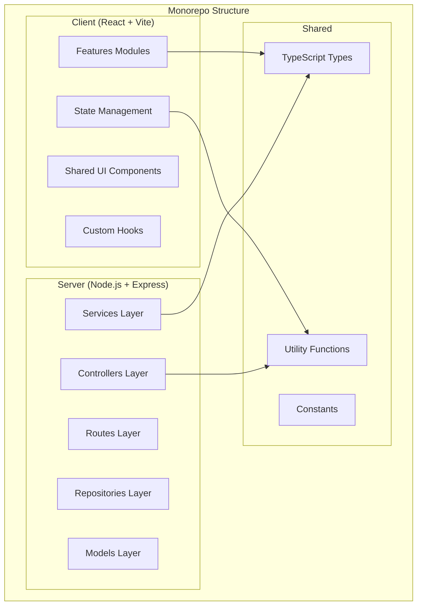

# Design Document

## Overview

Tài liệu này mô tả thiết kế chi tiết cho việc tái cấu trúc dự án Nexus từ cấu trúc flat sang kiến trúc client/server với phân quyền theo role. Thiết kế tập trung vào việc tổ chức code theo feature-based structure cho frontend và layer architecture cho backend.

## Architecture

### High-Level Architecture



### Directory Structure

```
nexus/
├── client/                          # Frontend React Application
│   ├── public/                      # Static assets
│   ├── src/
│   │   ├── features/                # Feature-based modules
│   │   │   ├── auth/
│   │   │   │   ├── components/
│   │   │   │   ├── hooks/
│   │   │   │   └── index.ts
│   │   │   ├── dashboard/
│   │   │   │   ├── admin/           # Admin-specific views
│   │   │   │   ├── manager/         # Manager-specific views
│   │   │   │   ├── employee/        # Employee-specific views
│   │   │   │   ├── shared/          # Shared components
│   │   │   │   └── index.ts
│   │   │   ├── projects/
│   │   │   │   ├── admin/
│   │   │   │   ├── manager/
│   │   │   │   ├── employee/
│   │   │   │   ├── shared/
│   │   │   │   └── index.ts
│   │   │   ├── organization/
│   │   │   │   ├── admin/
│   │   │   │   ├── manager/
│   │   │   │   ├── shared/
│   │   │   │   └── index.ts
│   │   │   └── workspace/
│   │   │       ├── admin/
│   │   │       ├── shared/
│   │   │       └── index.ts
│   │   ├── components/
│   │   │   └── ui/                  # Reusable UI components
│   │   │       ├── Button.tsx
│   │   │       ├── Input.tsx
│   │   │       └── index.ts
│   │   ├── hooks/                   # Global custom hooks
│   │   ├── store/                   # State management (Context/Zustand)
│   │   ├── routes/                  # Route definitions & guards
│   │   ├── utils/                   # Client-specific utilities
│   │   ├── App.tsx
│   │   └── main.tsx
│   ├── index.html
│   ├── vite.config.ts
│   ├── tsconfig.json
│   └── package.json
│
├── server/                          # Backend Node.js Application
│   ├── src/
│   │   ├── routes/                  # API route definitions
│   │   │   ├── auth.routes.ts
│   │   │   ├── users.routes.ts
│   │   │   ├── projects.routes.ts
│   │   │   └── index.ts
│   │   ├── controllers/             # Request handlers
│   │   │   ├── auth.controller.ts
│   │   │   ├── users.controller.ts
│   │   │   └── projects.controller.ts
│   │   ├── services/                # Business logic
│   │   │   ├── auth.service.ts
│   │   │   ├── users.service.ts
│   │   │   └── projects.service.ts
│   │   ├── repositories/            # Data access layer
│   │   │   ├── users.repository.ts
│   │   │   └── projects.repository.ts
│   │   ├── models/                  # Database models/schemas
│   │   ├── middleware/              # Express middleware
│   │   │   ├── auth.middleware.ts
│   │   │   ├── role.middleware.ts
│   │   │   └── validation.middleware.ts
│   │   ├── config/                  # Configuration
│   │   │   ├── database.ts
│   │   │   └── env.ts
│   │   ├── utils/                   # Server-specific utilities
│   │   └── app.ts                   # Express app setup
│   ├── tsconfig.json
│   └── package.json
│
├── shared/                          # Shared code between client/server
│   ├── types/
│   │   ├── user.types.ts
│   │   ├── project.types.ts
│   │   ├── organization.types.ts
│   │   ├── workspace.types.ts
│   │   └── index.ts
│   ├── utils/
│   │   ├── validation.ts
│   │   └── formatters.ts
│   ├── constants/
│   │   ├── roles.ts
│   │   └── status.ts
│   └── package.json
│
├── package.json                     # Root package.json (workspaces)
└── tsconfig.base.json               # Shared TypeScript config
```

## Components and Interfaces

### Client Components

#### Feature Module Structure

Mỗi feature module tuân theo cấu trúc:

```typescript
// features/projects/index.ts
export { ProjectModule } from './shared/ProjectModule';
export { AdminProjectView } from './admin/AdminProjectView';
export { ManagerProjectView } from './manager/ManagerProjectView';
export { EmployeeProjectView } from './employee/EmployeeProjectView';
```

#### Role-based Component Mapping

| Feature | Admin | Manager | Employee |
|---------|-------|---------|----------|
| Dashboard | Overview, ResourceManagement | Overview, TeamStats | Overview |
| Projects | Full CRUD, Settings | CRUD, Assign Tasks | View, Update Tasks |
| Organization | DepartmentManager, UserManager, OrgChart | UserManager (limited), OrgChart | OrgChart (view only) |
| Workspace | MeetingAdmin, RoomModal | RoomModal | RoomModal (booking only) |

#### Route Guards

```typescript
// routes/guards/RoleGuard.tsx
interface RoleGuardProps {
  allowedRoles: UserRole[];
  children: React.ReactNode;
  fallback?: React.ReactNode;
}
```

### Server Interfaces

#### Controller Interface

```typescript
// controllers/base.controller.ts
interface BaseController {
  getAll(req: Request, res: Response): Promise<void>;
  getById(req: Request, res: Response): Promise<void>;
  create(req: Request, res: Response): Promise<void>;
  update(req: Request, res: Response): Promise<void>;
  delete(req: Request, res: Response): Promise<void>;
}
```

#### Service Interface

```typescript
// services/base.service.ts
interface BaseService<T> {
  findAll(): Promise<T[]>;
  findById(id: string): Promise<T | null>;
  create(data: Partial<T>): Promise<T>;
  update(id: string, data: Partial<T>): Promise<T>;
  delete(id: string): Promise<boolean>;
}
```

#### Middleware Interface

```typescript
// middleware/role.middleware.ts
type RoleMiddleware = (allowedRoles: UserRole[]) => RequestHandler;
```

## Data Models

### Shared Types (từ types.ts hiện tại)

```typescript
// shared/types/user.types.ts
export enum UserRole {
  ADMIN = 'ADMIN',
  MANAGER = 'MANAGER',
  EMPLOYEE = 'EMPLOYEE',
}

export interface User {
  id: string;
  name: string;
  email: string;
  avatarUrl: string;
  department: string;
  role: UserRole;
}
```

### File Migration Map

| Current Location | New Location |
|-----------------|--------------|
| `types.ts` | `shared/types/` (split by domain) |
| `components/ui/*` | `client/src/components/ui/` |
| `components/LoginForm.tsx` | `client/src/features/auth/components/` |
| `components/LoginScreen.tsx` | `client/src/features/auth/components/` |
| `components/Dashboard.tsx` | `client/src/features/dashboard/shared/` |
| `components/dashboard/*` | `client/src/features/dashboard/admin/` |
| `components/projects/*` | `client/src/features/projects/shared/` |
| `components/organization/*` | `client/src/features/organization/admin/` |
| `components/workspace/*` | `client/src/features/workspace/admin/` |
| `data/mockData.ts` | `client/src/data/` (temporary) → `server/src/` (later) |
| `App.tsx` | `client/src/App.tsx` |
| `index.tsx` | `client/src/main.tsx` |


## Correctness Properties

*A property is a characteristic or behavior that should hold true across all valid executions of a system-essentially, a formal statement about what the system should do. Properties serve as the bridge between human-readable specifications and machine-verifiable correctness guarantees.*

### Property 1: Client/Server Code Separation

*For any* source file in the project, if it contains React components or frontend-specific code, it should be located within the `client` directory; if it contains API routes, controllers, or backend-specific code, it should be located within the `server` directory.

**Validates: Requirements 1.2, 1.3**

### Property 2: Feature Module Self-Containment

*For any* feature module, all components, hooks, and utilities specific to that feature should be contained within that feature's directory structure.

**Validates: Requirements 2.2**

### Property 3: Role-Based Component Organization

*For any* component that is role-specific (Admin, Manager, or Employee), it should be placed in the corresponding role subdirectory within its feature; *for any* component shared across roles, it should be placed in the `shared` subdirectory.

**Validates: Requirements 3.1, 3.2**

### Property 4: Route Guard Access Control

*For any* protected route and user role combination, the route guard should allow access only when the user's role is in the allowed roles list; otherwise, it should redirect to a fallback page.

**Validates: Requirements 3.3, 3.4**

### Property 5: Server Layer Architecture

*For any* API endpoint, the request flow should follow the pattern: route → controller → service → repository, with each layer having a single responsibility.

**Validates: Requirements 4.2**

### Property 6: Shared Code Placement

*For any* TypeScript type, utility function, or constant that is used by both client and server, it should be placed in the appropriate subdirectory within `shared` (types/, utils/, or constants/).

**Validates: Requirements 5.1, 5.2, 5.3**

## Error Handling

### Client-Side Error Handling

1. **Route Access Errors**: Khi user không có quyền truy cập route, hiển thị trang 403 Forbidden hoặc redirect về dashboard
2. **API Errors**: Sử dụng error boundary và toast notifications để hiển thị lỗi
3. **Loading States**: Hiển thị skeleton hoặc spinner khi đang load data

### Server-Side Error Handling

1. **Validation Errors**: Return 400 Bad Request với chi tiết lỗi
2. **Authentication Errors**: Return 401 Unauthorized
3. **Authorization Errors**: Return 403 Forbidden
4. **Not Found Errors**: Return 404 Not Found
5. **Server Errors**: Return 500 Internal Server Error với error logging

## Testing Strategy

### Unit Testing

- **Framework**: Vitest (cho cả client và server)
- **Coverage**: Tối thiểu 80% cho business logic

#### Client Unit Tests
- Test individual components với React Testing Library
- Test custom hooks
- Test utility functions

#### Server Unit Tests
- Test controllers với mocked services
- Test services với mocked repositories
- Test middleware functions

### Property-Based Testing

- **Framework**: fast-check
- **Minimum iterations**: 100 per property

#### Property Tests

1. **Route Guard Property Test**
   - Generate random user roles và route configurations
   - Verify access control logic is consistent
   - Tag: **Feature: project-restructure, Property 4: Route Guard Access Control**

2. **File Organization Property Test**
   - Generate random file paths
   - Verify files are in correct directories based on content type
   - Tag: **Feature: project-restructure, Property 1: Client/Server Code Separation**

### Integration Testing

- Test API endpoints end-to-end
- Test role-based access across features
- Test client-server communication
