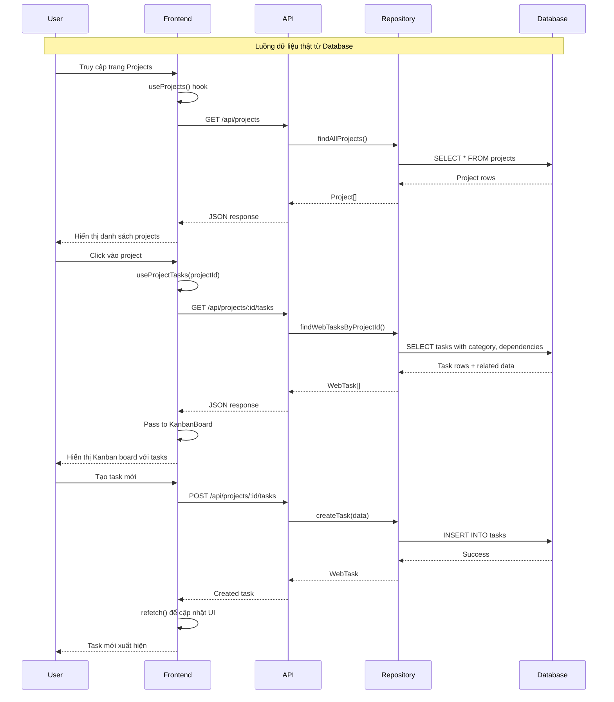

# Design Document: Real Data Migration

## Overview

Module này thực hiện việc chuyển đổi toàn bộ hệ thống từ mock data sang dữ liệu thật từ MySQL database. Mục tiêu chính:

- Loại bỏ hoàn toàn các file mock data (`client/src/data/mockData.ts`, `server/src/data/mockData.ts`)
- Đảm bảo tất cả React hooks gọi API thay vì import mock data
- Cập nhật seed data để có dữ liệu khởi tạo trong database
- Đảm bảo luồng dữ liệu: User → Frontend (Hook) → API → Repository → Database

## Architecture



## Components and Interfaces

### Files to Remove

```
client/src/data/mockData.ts    # Mock data cho client
server/src/data/mockData.ts    # Mock data cho server
```

### Files to Update

#### Client Hooks (đã có, cần verify)
- `client/src/hooks/useProjects.ts` - Fetch từ /api/projects
- `client/src/hooks/useEmployees.ts` - Fetch từ /api/employees  
- `client/src/hooks/useDepartments.ts` - Fetch từ /api/departments
- `client/src/hooks/useMeetingRooms.ts` - Fetch từ /api/meeting-rooms
- `client/src/hooks/useBookings.ts` - Fetch từ /api/bookings

#### Server Repositories (đã có)
- `server/src/repositories/project.repository.ts`
- `server/src/repositories/employee.repository.ts`
- `server/src/repositories/department.repository.ts`
- `server/src/repositories/workspace.repository.ts`
- `server/src/repositories/user.repository.ts`

### API Endpoints (đã có)

```typescript
// Projects
GET    /api/projects              // List all projects
GET    /api/projects/:id          // Get project by ID
POST   /api/projects              // Create project
PUT    /api/projects/:id          // Update project
DELETE /api/projects/:id          // Delete project

// Tasks
GET    /api/projects/:id/tasks    // Get tasks by project
POST   /api/projects/:id/tasks    // Create task
PUT    /api/projects/:id/tasks/:taskId       // Update task
DELETE /api/projects/:id/tasks/:taskId       // Delete task
PUT    /api/projects/:id/tasks/:taskId/move  // Move task

// Columns
GET    /api/projects/:id/columns           // Get columns
POST   /api/projects/:id/columns           // Create column
PUT    /api/projects/:id/columns/:columnId // Update column
DELETE /api/projects/:id/columns/:columnId // Delete column

// Employees
GET    /api/employees             // List employees
GET    /api/employees/:id         // Get employee
POST   /api/employees             // Create employee
PUT    /api/employees/:id         // Update employee
DELETE /api/employees/:id         // Delete employee

// Departments
GET    /api/departments           // List departments
GET    /api/departments/:id       // Get department
POST   /api/departments           // Create department
PUT    /api/departments/:id       // Update department
DELETE /api/departments/:id       // Delete department

// Meeting Rooms
GET    /api/meeting-rooms         // List rooms
GET    /api/meeting-rooms/:id     // Get room

// Bookings
GET    /api/bookings              // List bookings
POST   /api/bookings              // Create booking
PUT    /api/bookings/:id          // Update booking
GET    /api/meeting-rooms/:id/bookings  // Get room bookings

// Users
GET    /api/users                 // List users
GET    /api/users/:id             // Get user
PUT    /api/users/:id             // Update user
```

## Data Models

### Database Schema (đã có)

```sql
-- Core tables
users, departments, projects, tasks, task_columns, task_tags, 
checklist_items, comments, meeting_rooms, bookings

-- Web Project tables (đã implement)
project_resources, project_phases, project_tech_stack,
project_environments, deployment_history, design_reviews,
bug_reports, uat_feedback, project_signoffs
```

### Data Flow Pattern

```typescript
// Hook Pattern
function useProjects() {
  const [projects, setProjects] = useState<Project[]>([]);
  const [loading, setLoading] = useState(true);
  const [error, setError] = useState<string | null>(null);

  const fetchProjects = useCallback(async () => {
    try {
      setLoading(true);
      const data = await get<Project[]>('/projects');
      setProjects(data);
      setError(null);
    } catch (err) {
      setError('Failed to fetch projects');
    } finally {
      setLoading(false);
    }
  }, []);

  useEffect(() => {
    fetchProjects();
  }, [fetchProjects]);

  return { projects, loading, error, refetch: fetchProjects };
}
```

## Correctness Properties

*A property is a characteristic or behavior that should hold true across all valid executions of a system-essentially, a formal statement about what the system should do. Properties serve as the bridge between human-readable specifications and machine-verifiable correctness guarantees.*

### Property 1: Project CRUD Round Trip
*For any* valid project data, creating a project via POST /api/projects and then fetching it via GET /api/projects/:id SHALL return equivalent data.
**Validates: Requirements 2.2, 2.3**

### Property 2: Task CRUD Round Trip
*For any* valid task data, creating a task via POST /api/projects/:id/tasks and then fetching it SHALL return the task with auto-generated code and all provided data.
**Validates: Requirements 3.2, 3.4**

### Property 3: Task Move Persistence
*For any* task move operation, moving a task to a different column via PUT /api/projects/:id/tasks/:taskId/move and then fetching it SHALL show the task in the new column.
**Validates: Requirements 3.3**

### Property 4: Default Columns Initialization
*For any* newly created project, fetching columns via GET /api/projects/:id/columns SHALL return exactly 5 columns: Backlog, To Do, In Progress, Review, Done in correct order.
**Validates: Requirements 4.5**

### Property 5: Column CRUD Round Trip
*For any* valid column data, creating, updating, or deleting a column SHALL persist the changes to the database.
**Validates: Requirements 4.2, 4.3, 4.4**

### Property 6: Employee Data Completeness
*For any* employee fetched via GET /api/employees/:id, the response SHALL include department name and linked accounts.
**Validates: Requirements 5.2, 5.5**

### Property 7: Department Hierarchy Integrity
*For any* department with parent_dept_id, the parent department SHALL exist in the database.
**Validates: Requirements 6.5**

### Property 8: Booking Conflict Prevention
*For any* room at a given time, the system SHALL prevent overlapping bookings.
**Validates: Requirements 7.4**

### Property 9: Seed Data Idempotence
*For any* database, running the seed script multiple times SHALL not create duplicate records.
**Validates: Requirements 9.4**

### Property 10: Referential Integrity
*For any* foreign key relationship in the database, the referenced record SHALL exist.
**Validates: Requirements 9.3**

### Property 11: Hook Error Handling
*For any* API error, the corresponding hook SHALL set error state and not crash the application.
**Validates: Requirements 10.5**

### Property 12: Delete Cascade
*For any* deleted project, all related tasks, columns, and resources SHALL also be deleted.
**Validates: Requirements 2.4**

## Error Handling

### API Errors
- 400 Bad Request: Invalid input data
- 404 Not Found: Resource not found
- 409 Conflict: Duplicate or constraint violation
- 500 Internal Server Error: Database or server error

### Client Error Handling
```typescript
try {
  const data = await get<T>(endpoint);
  setData(data);
  setError(null);
} catch (err) {
  if (err instanceof APIError) {
    setError(err.message);
  } else {
    setError('Network error');
  }
}
```

## Testing Strategy

### Property-Based Testing Library
Sử dụng **fast-check** cho TypeScript/JavaScript property-based testing.

### Unit Tests
- Repository functions với database test
- API route handlers
- Hook behavior với mock API

### Property-Based Tests
1. **Property 1 Test**: Generate random project data, create then fetch, verify equality
2. **Property 2 Test**: Generate random task data, create then fetch, verify code generation and data
3. **Property 3 Test**: Generate random task moves, verify column changes persist
4. **Property 4 Test**: Create projects, verify default columns
5. **Property 5 Test**: Generate column operations, verify persistence
6. **Property 6 Test**: Fetch employees, verify data completeness
7. **Property 7 Test**: Create departments with parents, verify hierarchy
8. **Property 8 Test**: Generate overlapping bookings, verify rejection
9. **Property 9 Test**: Run seed multiple times, verify no duplicates
10. **Property 10 Test**: Verify all foreign keys reference existing records
11. **Property 11 Test**: Simulate API errors, verify hook error handling
12. **Property 12 Test**: Delete projects, verify cascade deletion

### Integration Tests
- End-to-end flow: Create project → Add tasks → Move tasks → Delete project
- Authentication flow: Login → Access protected routes → Logout

### Test Configuration
```typescript
// vitest.config.ts
export default {
  test: {
    include: ['**/*.test.ts', '**/*.property.test.ts'],
    setupFiles: ['./test/setup.ts'],
    coverage: {
      reporter: ['text', 'json', 'html'],
      threshold: {
        branches: 80,
        functions: 80,
        lines: 80
      }
    }
  }
};
```

