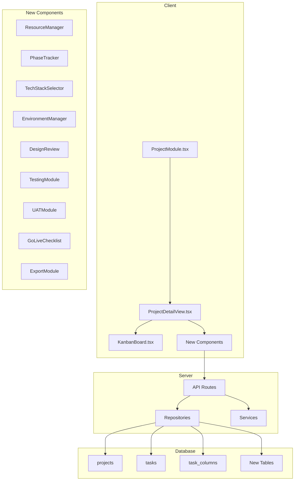

# Design Document: Web Project Management

## Overview

Module Quản lý Dự án Web mở rộng hệ thống quản lý dự án hiện có để hỗ trợ quy trình phát triển website chuyên nghiệp. Module này tích hợp với cấu trúc database và components hiện có (projects, tasks, task_columns) đồng thời bổ sung các tính năng mới cho:

- Quản lý tài nguyên đầu vào (Sitemap, SRS, Design Assets, Credentials)
- Theo dõi giai đoạn dự án (6 phases workflow)
- Quản lý Tech Stack và môi trường triển khai
- Design review và approval workflow
- Testing, UAT và Go Live process
- Export/Import dữ liệu với round-trip validation

## Architecture



## Components and Interfaces

### New Database Tables

#### project_resources
```sql
CREATE TABLE project_resources (
  id VARCHAR(36) PRIMARY KEY,
  project_id VARCHAR(36) NOT NULL,
  type ENUM('SITEMAP', 'SRS', 'WIREFRAME', 'MOCKUP', 'FIGMA_LINK', 'ASSET', 'CREDENTIAL') NOT NULL,
  name VARCHAR(255) NOT NULL,
  file_path TEXT,
  url TEXT,
  version INT DEFAULT 1,
  status ENUM('PENDING', 'APPROVED', 'REJECTED') DEFAULT 'PENDING',
  approved_by VARCHAR(36),
  approved_at TIMESTAMP,
  encrypted_data TEXT,
  created_at TIMESTAMP DEFAULT CURRENT_TIMESTAMP,
  updated_at TIMESTAMP DEFAULT CURRENT_TIMESTAMP ON UPDATE CURRENT_TIMESTAMP,
  FOREIGN KEY (project_id) REFERENCES projects(id) ON DELETE CASCADE,
  FOREIGN KEY (approved_by) REFERENCES users(id) ON DELETE SET NULL
);
```

#### project_phases
```sql
CREATE TABLE project_phases (
  id VARCHAR(36) PRIMARY KEY,
  project_id VARCHAR(36) NOT NULL,
  phase_type ENUM('KICKOFF', 'TECHNICAL_PLANNING', 'DEVELOPMENT', 'INTERNAL_TESTING', 'UAT', 'GO_LIVE') NOT NULL,
  position INT NOT NULL,
  status ENUM('PENDING', 'IN_PROGRESS', 'COMPLETED', 'BLOCKED') DEFAULT 'PENDING',
  started_at TIMESTAMP,
  completed_at TIMESTAMP,
  blocked_reason TEXT,
  created_at TIMESTAMP DEFAULT CURRENT_TIMESTAMP,
  FOREIGN KEY (project_id) REFERENCES projects(id) ON DELETE CASCADE
);
```

#### project_tech_stack
```sql
CREATE TABLE project_tech_stack (
  id VARCHAR(36) PRIMARY KEY,
  project_id VARCHAR(36) NOT NULL,
  category ENUM('LANGUAGE', 'FRAMEWORK', 'DATABASE', 'HOSTING', 'OTHER') NOT NULL,
  name VARCHAR(100) NOT NULL,
  version VARCHAR(50),
  is_locked BOOLEAN DEFAULT FALSE,
  locked_at TIMESTAMP,
  locked_by VARCHAR(36),
  created_at TIMESTAMP DEFAULT CURRENT_TIMESTAMP,
  FOREIGN KEY (project_id) REFERENCES projects(id) ON DELETE CASCADE,
  FOREIGN KEY (locked_by) REFERENCES users(id) ON DELETE SET NULL
);
```

#### project_environments
```sql
CREATE TABLE project_environments (
  id VARCHAR(36) PRIMARY KEY,
  project_id VARCHAR(36) NOT NULL,
  env_type ENUM('LOCAL', 'STAGING', 'PRODUCTION') NOT NULL,
  url TEXT,
  current_version VARCHAR(50),
  last_deployed_at TIMESTAMP,
  last_deployed_by VARCHAR(36),
  ssl_enabled BOOLEAN DEFAULT FALSE,
  created_at TIMESTAMP DEFAULT CURRENT_TIMESTAMP,
  FOREIGN KEY (project_id) REFERENCES projects(id) ON DELETE CASCADE,
  FOREIGN KEY (last_deployed_by) REFERENCES users(id) ON DELETE SET NULL
);
```

#### deployment_history
```sql
CREATE TABLE deployment_history (
  id VARCHAR(36) PRIMARY KEY,
  environment_id VARCHAR(36) NOT NULL,
  version VARCHAR(50) NOT NULL,
  deployed_by VARCHAR(36) NOT NULL,
  deployed_at TIMESTAMP DEFAULT CURRENT_TIMESTAMP,
  commit_hash VARCHAR(100),
  notes TEXT,
  status ENUM('SUCCESS', 'FAILED', 'ROLLBACK') DEFAULT 'SUCCESS',
  FOREIGN KEY (environment_id) REFERENCES project_environments(id) ON DELETE CASCADE,
  FOREIGN KEY (deployed_by) REFERENCES users(id) ON DELETE CASCADE
);
```

#### design_reviews
```sql
CREATE TABLE design_reviews (
  id VARCHAR(36) PRIMARY KEY,
  project_id VARCHAR(36) NOT NULL,
  resource_id VARCHAR(36) NOT NULL,
  status ENUM('PENDING', 'APPROVED', 'REJECTED', 'CHANGE_REQUESTED') DEFAULT 'PENDING',
  reviewer_id VARCHAR(36),
  reviewed_at TIMESTAMP,
  comments TEXT,
  version_locked INT,
  created_at TIMESTAMP DEFAULT CURRENT_TIMESTAMP,
  FOREIGN KEY (project_id) REFERENCES projects(id) ON DELETE CASCADE,
  FOREIGN KEY (resource_id) REFERENCES project_resources(id) ON DELETE CASCADE,
  FOREIGN KEY (reviewer_id) REFERENCES users(id) ON DELETE SET NULL
);
```

#### bug_reports
```sql
CREATE TABLE bug_reports (
  id VARCHAR(36) PRIMARY KEY,
  project_id VARCHAR(36) NOT NULL,
  task_id VARCHAR(36),
  title VARCHAR(255) NOT NULL,
  description TEXT,
  severity ENUM('LOW', 'MEDIUM', 'HIGH', 'CRITICAL') NOT NULL,
  status ENUM('OPEN', 'IN_PROGRESS', 'RESOLVED', 'CLOSED', 'WONT_FIX') DEFAULT 'OPEN',
  environment ENUM('LOCAL', 'STAGING', 'PRODUCTION') NOT NULL,
  reproduction_steps TEXT NOT NULL,
  reported_by VARCHAR(36) NOT NULL,
  assigned_to VARCHAR(36),
  resolved_at TIMESTAMP,
  created_at TIMESTAMP DEFAULT CURRENT_TIMESTAMP,
  FOREIGN KEY (project_id) REFERENCES projects(id) ON DELETE CASCADE,
  FOREIGN KEY (task_id) REFERENCES tasks(id) ON DELETE SET NULL,
  FOREIGN KEY (reported_by) REFERENCES users(id) ON DELETE CASCADE,
  FOREIGN KEY (assigned_to) REFERENCES users(id) ON DELETE SET NULL
);
```

#### uat_feedback
```sql
CREATE TABLE uat_feedback (
  id VARCHAR(36) PRIMARY KEY,
  project_id VARCHAR(36) NOT NULL,
  feature_name VARCHAR(255),
  page_url TEXT,
  feedback_text TEXT NOT NULL,
  status ENUM('PENDING', 'ADDRESSED', 'REJECTED') DEFAULT 'PENDING',
  provided_by VARCHAR(255) NOT NULL,
  addressed_at TIMESTAMP,
  created_at TIMESTAMP DEFAULT CURRENT_TIMESTAMP,
  FOREIGN KEY (project_id) REFERENCES projects(id) ON DELETE CASCADE
);
```

#### project_signoffs
```sql
CREATE TABLE project_signoffs (
  id VARCHAR(36) PRIMARY KEY,
  project_id VARCHAR(36) NOT NULL,
  signoff_type ENUM('DESIGN', 'UAT', 'GO_LIVE') NOT NULL,
  approver_name VARCHAR(255) NOT NULL,
  approver_email VARCHAR(255),
  signature_data TEXT,
  signed_at TIMESTAMP DEFAULT CURRENT_TIMESTAMP,
  notes TEXT,
  FOREIGN KEY (project_id) REFERENCES projects(id) ON DELETE CASCADE
);
```

### TypeScript Interfaces

```typescript
// shared/types/web-project.types.ts

export type ResourceType = 'SITEMAP' | 'SRS' | 'WIREFRAME' | 'MOCKUP' | 'FIGMA_LINK' | 'ASSET' | 'CREDENTIAL';
export type PhaseType = 'KICKOFF' | 'TECHNICAL_PLANNING' | 'DEVELOPMENT' | 'INTERNAL_TESTING' | 'UAT' | 'GO_LIVE';
export type PhaseStatus = 'PENDING' | 'IN_PROGRESS' | 'COMPLETED' | 'BLOCKED';
export type EnvironmentType = 'LOCAL' | 'STAGING' | 'PRODUCTION';
export type BugSeverity = 'LOW' | 'MEDIUM' | 'HIGH' | 'CRITICAL';
export type TaskCategory = 'FRONTEND' | 'BACKEND' | 'DESIGN' | 'DEVOPS' | 'QA';

export interface ProjectResource {
  id: string;
  projectId: string;
  type: ResourceType;
  name: string;
  filePath?: string;
  url?: string;
  version: number;
  status: 'PENDING' | 'APPROVED' | 'REJECTED';
  approvedBy?: string;
  approvedAt?: string;
  createdAt: string;
}

export interface ProjectPhase {
  id: string;
  projectId: string;
  phaseType: PhaseType;
  position: number;
  status: PhaseStatus;
  startedAt?: string;
  completedAt?: string;
  blockedReason?: string;
}

export interface TechStackItem {
  id: string;
  projectId: string;
  category: 'LANGUAGE' | 'FRAMEWORK' | 'DATABASE' | 'HOSTING' | 'OTHER';
  name: string;
  version?: string;
  isLocked: boolean;
  lockedAt?: string;
  lockedBy?: string;
}

export interface ProjectEnvironment {
  id: string;
  projectId: string;
  envType: EnvironmentType;
  url?: string;
  currentVersion?: string;
  lastDeployedAt?: string;
  lastDeployedBy?: string;
  sslEnabled: boolean;
  deploymentHistory?: DeploymentRecord[];
}

export interface DeploymentRecord {
  id: string;
  environmentId: string;
  version: string;
  deployedBy: string;
  deployedAt: string;
  commitHash?: string;
  notes?: string;
  status: 'SUCCESS' | 'FAILED' | 'ROLLBACK';
}

export interface DesignReview {
  id: string;
  projectId: string;
  resourceId: string;
  status: 'PENDING' | 'APPROVED' | 'REJECTED' | 'CHANGE_REQUESTED';
  reviewerId?: string;
  reviewedAt?: string;
  comments?: string;
  versionLocked?: number;
}

export interface BugReport {
  id: string;
  projectId: string;
  taskId?: string;
  title: string;
  description?: string;
  severity: BugSeverity;
  status: 'OPEN' | 'IN_PROGRESS' | 'RESOLVED' | 'CLOSED' | 'WONT_FIX';
  environment: EnvironmentType;
  reproductionSteps: string;
  reportedBy: string;
  assignedTo?: string;
  resolvedAt?: string;
  createdAt: string;
}

export interface UATFeedback {
  id: string;
  projectId: string;
  featureName?: string;
  pageUrl?: string;
  feedbackText: string;
  status: 'PENDING' | 'ADDRESSED' | 'REJECTED';
  providedBy: string;
  addressedAt?: string;
  createdAt: string;
}

export interface ProjectSignoff {
  id: string;
  projectId: string;
  signoffType: 'DESIGN' | 'UAT' | 'GO_LIVE';
  approverName: string;
  approverEmail?: string;
  signatureData?: string;
  signedAt: string;
  notes?: string;
}

// Extended Task with category
export interface WebTask extends Task {
  category: TaskCategory;
  commitReference?: string;
  dependencies?: string[];
}

// Project Export/Import format
export interface ProjectExport {
  version: string;
  exportedAt: string;
  project: Project;
  phases: ProjectPhase[];
  resources: ProjectResource[];
  techStack: TechStackItem[];
  environments: ProjectEnvironment[];
  tasks: WebTask[];
  columns: TaskColumn[];
  bugReports: BugReport[];
  uatFeedback: UATFeedback[];
  signoffs: ProjectSignoff[];
}
```

### API Endpoints

```typescript
// Project Resources
POST   /api/projects/:id/resources          // Upload resource
GET    /api/projects/:id/resources          // List resources
PUT    /api/projects/:id/resources/:rid     // Update resource
DELETE /api/projects/:id/resources/:rid     // Delete resource
POST   /api/projects/:id/resources/:rid/approve  // Approve resource

// Project Phases
GET    /api/projects/:id/phases             // Get all phases
PUT    /api/projects/:id/phases/:pid        // Update phase status
POST   /api/projects/:id/phases/:pid/transition  // Transition to next phase

// Tech Stack
GET    /api/projects/:id/tech-stack         // Get tech stack
POST   /api/projects/:id/tech-stack         // Add tech stack item
PUT    /api/projects/:id/tech-stack/:tid    // Update item
POST   /api/projects/:id/tech-stack/lock    // Lock tech stack

// Environments
GET    /api/projects/:id/environments       // Get environments
PUT    /api/projects/:id/environments/:eid  // Update environment
POST   /api/projects/:id/environments/:eid/deploy  // Record deployment

// Design Reviews
GET    /api/projects/:id/design-reviews     // Get reviews
POST   /api/projects/:id/design-reviews     // Create review
PUT    /api/projects/:id/design-reviews/:did  // Update review status

// Bug Reports
GET    /api/projects/:id/bugs               // List bugs
POST   /api/projects/:id/bugs               // Report bug
PUT    /api/projects/:id/bugs/:bid          // Update bug

// UAT
GET    /api/projects/:id/uat-feedback       // Get feedback
POST   /api/projects/:id/uat-feedback       // Add feedback
PUT    /api/projects/:id/uat-feedback/:fid  // Update feedback

// Signoffs
GET    /api/projects/:id/signoffs           // Get signoffs
POST   /api/projects/:id/signoffs           // Create signoff

// Export/Import
GET    /api/projects/:id/export             // Export project JSON
POST   /api/projects/import                 // Import project from JSON
GET    /api/projects/:id/export/pdf         // Export PDF report
GET    /api/projects/:id/export/csv         // Export CSV
```

## Data Models

### Phase Transition Rules

```typescript
const PHASE_REQUIREMENTS: Record<PhaseType, string[]> = {
  KICKOFF: [],
  TECHNICAL_PLANNING: ['SITEMAP', 'SRS', 'TECH_STACK_SELECTED'],
  DEVELOPMENT: ['DB_SCHEMA_APPROVED', 'API_DOC_APPROVED', 'DESIGN_APPROVED'],
  INTERNAL_TESTING: ['STAGING_DEPLOYED', 'ALL_DEV_TASKS_COMPLETE'],
  UAT: ['NO_CRITICAL_BUGS', 'TEST_CHECKLIST_COMPLETE'],
  GO_LIVE: ['UAT_SIGNOFF', 'ALL_FEEDBACK_ADDRESSED']
};

const PHASE_ORDER: PhaseType[] = [
  'KICKOFF',
  'TECHNICAL_PLANNING', 
  'DEVELOPMENT',
  'INTERNAL_TESTING',
  'UAT',
  'GO_LIVE'
];
```

### Resource Validation Rules

```typescript
const VALID_FILE_FORMATS: Record<ResourceType, string[]> = {
  SITEMAP: ['pdf', 'doc', 'docx', 'xls', 'xlsx', 'png', 'jpg', 'jpeg'],
  SRS: ['pdf', 'doc', 'docx', 'md'],
  WIREFRAME: ['pdf', 'png', 'jpg', 'jpeg', 'fig', 'xd'],
  MOCKUP: ['pdf', 'png', 'jpg', 'jpeg', 'fig', 'xd', 'psd'],
  FIGMA_LINK: [], // URL validation
  ASSET: ['zip', 'png', 'jpg', 'jpeg', 'svg', 'ttf', 'otf', 'woff', 'woff2'],
  CREDENTIAL: [] // Encrypted storage
};
```

### Tech Stack Compatibility Matrix

```typescript
const TECH_COMPATIBILITY: Record<string, string[]> = {
  'React': ['Node.js', 'Express', 'Next.js', 'MySQL', 'PostgreSQL', 'MongoDB'],
  'Vue.js': ['Node.js', 'Express', 'Nuxt.js', 'MySQL', 'PostgreSQL', 'MongoDB'],
  'Angular': ['Node.js', 'Express', 'MySQL', 'PostgreSQL'],
  'Laravel': ['PHP', 'MySQL', 'PostgreSQL'],
  'Django': ['Python', 'PostgreSQL', 'MySQL'],
  'WordPress': ['PHP', 'MySQL']
};
```

## Correctness Properties

*A property is a characteristic or behavior that should hold true across all valid executions of a system-essentially, a formal statement about what the system should do. Properties serve as the bridge between human-readable specifications and machine-verifiable correctness guarantees.*

### Property 1: Project Initialization Completeness
*For any* newly created project, the system SHALL initialize it with exactly 6 phases in the correct order (KICKOFF → TECHNICAL_PLANNING → DEVELOPMENT → INTERNAL_TESTING → UAT → GO_LIVE) and 3 environments (LOCAL, STAGING, PRODUCTION).
**Validates: Requirements 2.1, 4.1**

### Property 2: Resource File Format Validation
*For any* uploaded resource file, the system SHALL accept only files with extensions matching the allowed formats for that resource type, and reject all others.
**Validates: Requirements 1.2, 1.3**

### Property 3: Phase Transition Validation
*For any* phase transition attempt, the system SHALL allow transition only if all required deliverables for the current phase are completed, and SHALL reject any attempt to skip phases.
**Validates: Requirements 2.2, 2.6**

### Property 4: Tech Stack Immutability After Lock
*For any* locked tech stack, the system SHALL reject all modification attempts without Manager approval, preserving the original configuration.
**Validates: Requirements 3.3**

### Property 5: Deployment Recording Completeness
*For any* deployment to Staging or Production, the recorded deployment SHALL contain timestamp, version, deployer information, and commit hash.
**Validates: Requirements 4.2, 4.5**

### Property 6: Production Deployment Gate
*For any* Production deployment request, the system SHALL reject the request if UAT sign-off is not complete, regardless of other conditions.
**Validates: Requirements 4.3**

### Property 7: Task Category-Role Validation
*For any* task assignment, the system SHALL validate that the assignee's role matches the task category (e.g., Frontend tasks to Frontend developers).
**Validates: Requirements 5.2**

### Property 8: Design Approval Blocks Frontend Tasks
*For any* project without approved design, the system SHALL prevent creation of Frontend development tasks.
**Validates: Requirements 6.5**

### Property 9: Bug Report Required Fields
*For any* bug report, the system SHALL require severity level, reproduction steps, and affected environment before accepting the report.
**Validates: Requirements 7.2**

### Property 10: Critical Bug Blocks Phase Transition
*For any* project with unresolved critical bugs, the system SHALL block transition to UAT phase and Production deployment.
**Validates: Requirements 7.3**

### Property 11: UAT Feedback Completeness Gate
*For any* project with pending UAT feedback items, the system SHALL disable the Sign-off request function until all items are addressed.
**Validates: Requirements 8.3**

### Property 12: Sign-off Recording Completeness
*For any* sign-off action, the recorded sign-off SHALL contain timestamp, approver name, and signature data.
**Validates: Requirements 8.4**

### Property 13: JSON Export-Import Round Trip
*For any* valid project, exporting to JSON and then importing SHALL produce a project with equivalent data (phases, resources, tasks, environments, etc.).
**Validates: Requirements 10.3**

### Property 14: Task Grouping by Category
*For any* task board display, tasks SHALL be correctly grouped by their category (Frontend, Backend, Design, DevOps, QA).
**Validates: Requirements 5.5**

### Property 15: Environment Status Display Completeness
*For any* environment status display, the output SHALL include current version, last deployment time, and deployment history.
**Validates: Requirements 4.5**

## Error Handling

### Validation Errors
- Invalid file format: Return 400 with allowed formats list
- Missing required fields: Return 400 with field names
- Phase transition blocked: Return 409 with missing requirements
- Unauthorized action: Return 403 with required permissions

### Business Logic Errors
- Tech stack locked: Return 409 with lock timestamp and locker info
- Design not approved: Return 409 with pending review details
- Critical bugs exist: Return 409 with bug summary
- UAT not signed off: Return 409 with pending feedback count

### System Errors
- Database connection: Return 500 with retry suggestion
- File upload failed: Return 500 with storage error details
- Export generation failed: Return 500 with partial data info

## Testing Strategy

### Property-Based Testing Library
Sử dụng **fast-check** cho TypeScript/JavaScript property-based testing.

### Unit Tests
- Resource validation functions
- Phase transition logic
- Tech stack compatibility checker
- Bug severity calculations
- Export/Import serialization

### Property-Based Tests
Mỗi correctness property sẽ được implement bằng một property-based test riêng biệt:

1. **Property 1 Test**: Generate random project creation requests, verify initialization completeness
2. **Property 2 Test**: Generate random file uploads with various extensions, verify validation
3. **Property 3 Test**: Generate random phase states and transition attempts, verify rules
4. **Property 4 Test**: Generate locked tech stacks and modification attempts, verify immutability
5. **Property 5 Test**: Generate deployment records, verify all required fields present
6. **Property 6 Test**: Generate deployment requests with various UAT states, verify gate
7. **Property 7 Test**: Generate task assignments with various role combinations, verify validation
8. **Property 8 Test**: Generate projects with various design states, verify task creation blocking
9. **Property 9 Test**: Generate bug reports with various field combinations, verify validation
10. **Property 10 Test**: Generate projects with various bug states, verify blocking
11. **Property 11 Test**: Generate projects with various feedback states, verify sign-off gate
12. **Property 12 Test**: Generate sign-off actions, verify recording completeness
13. **Property 13 Test**: Generate random valid projects, export then import, verify equality
14. **Property 14 Test**: Generate tasks with various categories, verify grouping
15. **Property 15 Test**: Generate environments with deployment history, verify display completeness

### Test Configuration
```typescript
// vitest.config.ts
export default {
  test: {
    include: ['**/*.test.ts', '**/*.property.test.ts'],
    coverage: {
      reporter: ['text', 'json', 'html'],
      threshold: {
        branches: 80,
        functions: 80,
        lines: 80
      }
    }
  }
};
```

### Property Test Template
```typescript
import fc from 'fast-check';
import { describe, it, expect } from 'vitest';

describe('Property Tests', () => {
  it('**Feature: web-project-management, Property 13: JSON Export-Import Round Trip**', () => {
    fc.assert(
      fc.property(
        projectArbitrary, // Generator for valid projects
        (project) => {
          const exported = exportProject(project);
          const imported = importProject(exported);
          return deepEqual(project, imported);
        }
      ),
      { numRuns: 100 }
    );
  });
});
```
